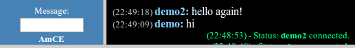
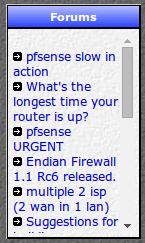
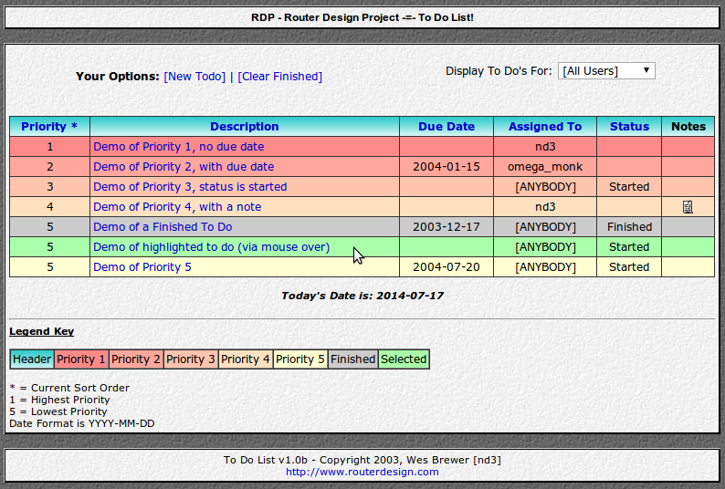
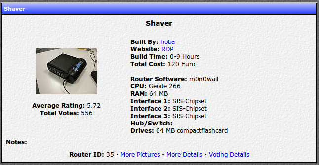
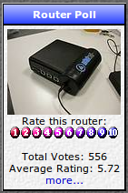
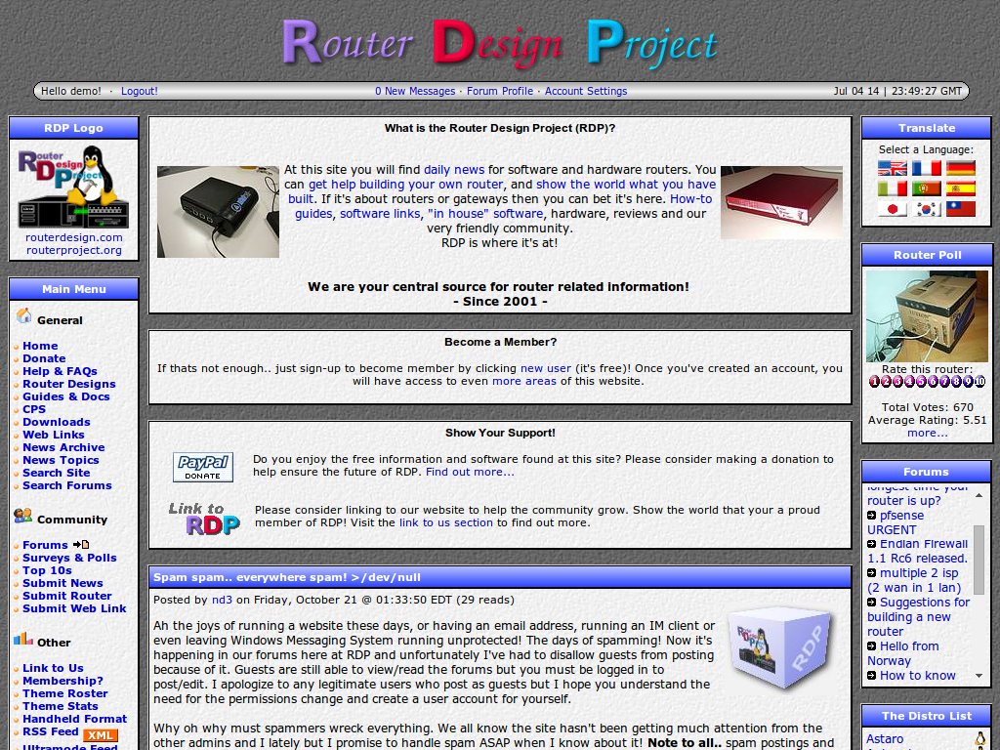

# PHP-Nuke-modules

These are some of the old modules I created for PHP-Nuke back when I ran a website named Router Design Project from 2001 until 2006. I no longer have control over the domain for the old website and so I won't link it here, be mindful of that if you find the domain mentioned in the code or documentation.

Please note that these modules haven't been used or maintained since early 2006. PHP-Nuke itself hasn't been maintained since 2014. Many lines of code in these modules are most likely deprecated in favour of better php practices.

This code has been uploaded here for archival and sharing purposes.

The commit dates will reflect when they were pushed to github, not when I originally created them as I wasn't using any version control system at the time.

I have done a commit for each version change I have available for completion sake.

More info about each module can be found below:

## AmCE - Admin miniChat Engine

This code can most likely be adapted to work with any PHP based site regardless if PHP-Nuke is being used.

AmCE is a small HTML based chat room for administrators or selected users at a PHP-Nuke driven website. It is designed to be very light on resources on both the server and client. It does not require access to a database and only does periodic updates via HTML META refresh code. While the chat engine does not work in real-time, it should be effective enough for a small amount of users.

The engine itself is contained within one file (minichat.php). AmCE is designed to be very lightweight and as such it has very minimal security, via use of a secret keycode. It should be noted that the files online.txt and auth.txt have no security and can be viewed publicly with a direct HTTP URL call.

The engine supports 2 modes, one for site admins only (admin mode) and one for selected users (user mode). Admin mode has more connection options but only admins who are logged in may use it. User mode forces connection to chat when an authorized user logs in and forces disconnection when the user logs out.

More information can be found in the included readme.txt file.

## QScroll Blocks

QScroll Blocks allows any PHP-Nuke block to be auto-scrolled after the site loads in a web browser. It does not require use of a database backend as it was intended to be a quick solution for what I wanted. It is not optimized for speed but still shouldn’t require much load time. It uses browser IFRAME code for scrolling when available, failing this it will display the block as normal (with no scrolling).

QScroll Blocks supports 4 scroll modes which can be set by the admin. These are:

0 = Manual scroll bars only (no auto scrolling)
1 = Auto scrolling which can be stopped permanently by the viewer via “mouse over” (recommended)
2 = Auto scrolling which can be temporarily stopped by the viewer via “mouse over”
3 = Auto scrolling which is always on (not recommend for blocks with weblinks)

More information can be found in the included readme.txt file.

## ToDo List

The ToDo List is a to do list for site administrators. The list runs as a PHP-Nuke admin module and supports multiple administrators.

### Features

* easy to use interface (colour coded display)
* assign by priority (1-5)
* create due dates (with easy to use calendar)
* assign a to do to any or all site administrators
* display to do current status (normal, started, finished)
* ability to clear all finished to do’s with one click
* sort by priority, description, due date, assigned, and status

More information can be found in the included readme.txt file.

## RouterScript

RouterScript is a picture and info library for easy display and submission of router designs to the Router Design Project website.

### Features

* display sorting features (routers per page, sort by, sort order)
* voting pool for uses to rate each others designs
* auto thumbnail creation for uploaded pictures
* theme support
* waiting content notification support
* administration module (create, edit and delete designs)

More information can be found in the included readme.txt file.

## PHP-Nuke Themes (with phpBB support)

Included are 33 custom PHP-Nuke themes and many matching phpBB themes. These themes are designed to work with PHP-Nuke version 7.6 and phpBB 2 forums (which was included with php-nuke). These themes were last updated in 2005.

The style sheets (css) are combined into one file and therefore work as one overall site theme. Installation of the included phpBB template is optional. All themes are created from scratch by me except for the ExtraLite theme which was modified by me. All themes also provide support for my RouterScript module mentioned above.

This pack comes with a ThemeStats module which can be used to view the usage statistics of these themes. With this you can easily see how many users are using each theme on your site.
